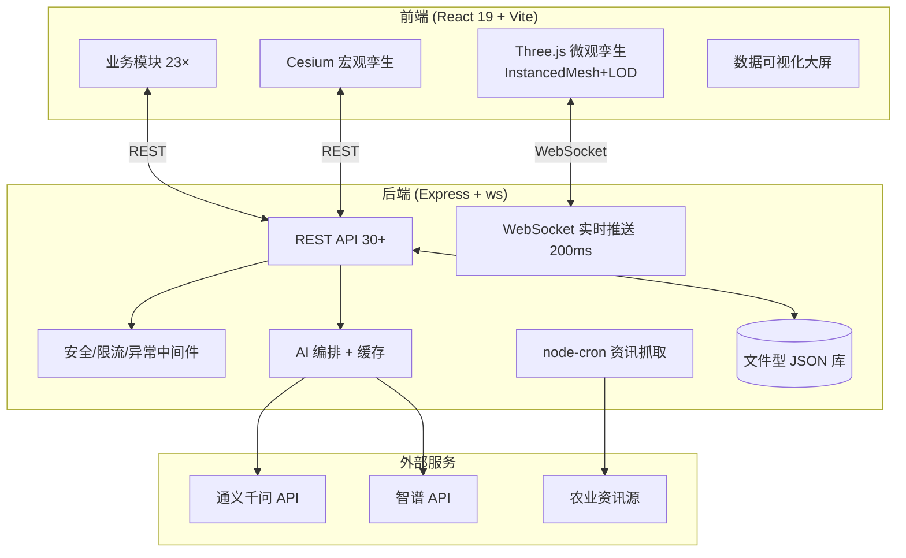

# 需求分析与系统架构设计

## 一、选题背景与价值

### 1.1 痛点

传统农业生产管理面临三大痛点：

1. **监管粗放、滞后**：田间长势、墒情、病虫害依赖人工巡查，效率低、覆盖不全、响应滞后。
2. **数据孤岛、宏微观断层**：现有农业数字孪生多停留在卫星/无人机的**宏观地块**层面，缺乏对**单株—器官**级别的微观刻画，IoT 传感数据难以与三维形态对应。
3. **决策经验化**：种植密度、水肥、品种选择多凭经验，缺少数据驱动的量化预演与风险评估。

### 1.2 目标用户

- 家庭农场主、种植大户、农业合作社
- 农技推广人员、农业园区管理者
- 农业院校教学与科研场景

### 1.3 价值主张

以「数字孪生 + IoT + AI」构建可落地的智慧农业管理系统，实现 **监测可视化、诊断智能化、决策数据化、操作远程化**，并以纯代码程序化三维渲染保证零外部模型依赖、可复现、可推广。

## 二、需求清单

### 2.1 功能性需求

| 编号 | 模块 | 需求描述 |
| :-- | :-- | :-- |
| F1 | 用户与权限 | 注册/登录、个人资料、头像、密码与二次验证（2FA）、收藏 |
| F2 | 农田监测 | 实时温湿度、光照、CO₂、土壤 NPK/墒情，WebSocket 推送，阈值告警 |
| F3 | 宏观孪生 | Cesium 地理底座，地块分布、飞行漫游、地块选择联动 |
| F4 | 微观孪生 | 纯代码 Three.js 单株级建模，生育期/状态/产量可视化，单株查询、土壤剖面、框选聚合 |
| F5 | AI 病害识别 | 上传图像，多模型识别病害类型、置信度、防治方案 |
| F6 | AI 种植决策 | 基于地块数据的作物推荐、ROI 核算、风险分析 |
| F7 | AI 知识问答 | 农技知识库检索 + 大模型问答 |
| F8 | 设备控制 | 灌溉/通风/补光/施肥远程开关，状态联动孪生体 |
| F9 | 资讯推送 | 农业政策/科普资讯抓取与聚合 |
| F10 | 运维 | 规则引擎、日志、反馈、健康检查 |

### 2.2 非功能性需求

| 维度 | 指标 |
| :-- | :-- |
| 性能 | 千株微观场景 ≥45 FPS；核心只读接口 P95 < 200ms（缓存命中）|
| 健壮性 | 异常输入/网络波动/越权不崩溃；进程长时间运行无内存泄漏 |
| 安全 | 安全响应头、限流、输入校验、敏感信息不入库明文 |
| 兼容性 | Chrome / Edge / Firefox 主流浏览器；PC 为主、响应式适配平板/手机 |
| 可维护 | 前后端分离、模块化、TypeScript 全量类型检查通过 |

## 三、技术栈

| 层 | 技术选型 |
| :-- | :-- |
| 前端框架 | React 19 + TypeScript + Vite 6 |
| 样式 | Tailwind CSS v4 + 自定义深色科技设计语言 |
| 宏观三维 | Cesium + Resium（地理信息底座）|
| 微观三维 | Three.js + @react-three/fiber + drei + postprocessing（纯代码程序化）|
| 可视化 | Recharts + D3 + 自研 SVG 大屏 |
| 动效 | GSAP + Motion |
| 国际化 | i18next（中/英）|
| 后端 | Node.js + Express + ws（WebSocket）|
| 定时任务 | node-cron（资讯/知识抓取）|
| 数据持久化 | 文件型 JSON 库（`.data/nxzj_db.json`，带重试与锁）|
| AI 能力 | 通义千问（Qwen）+ 智谱（Zhipu）多模型编排 + 24h 结果缓存 |

## 四、系统架构



### 4.1 四级孪生联动

```
全域(Cesium 地图) → 地块(Plot) → 单株(InstancedMesh 实例) → 器官(根/茎/叶/穗)
        宏观                    地理坐标 ←→ 属性数据 一一对应                微观
```

宏观点击地块 → 平滑切换微观视角 → 点击单株呼出器官级数据（株高/茎粗/叶片数/叶倾角/根深/穗粒数/长势评分）。

## 五、微观孪生渲染架构（核心技术）

- **实例化渲染**：每田块作物以 `InstancedMesh` 绘制（茎 + 叶 + 穗 ≤3 批 draw call），单地块 ≥1000 株。
- **LOD + 视锥裁剪**：远/中/近三档几何与着色复杂度自适应；视锥外地块剔除。
- **农艺参数化建模**：`cropAgronomy.ts` 维护各品种分生育期真实数据（株高/茎粗/叶片数/叶倾角/根深/行距/株距/穗部参数），作为渲染与查询的唯一数据源。
- **全着色器动态生理**：顶点着色器实现风场（风力/风向可调）、生长动画、风致倒伏；片元着色器实现叶脉、近似次表面散射、病斑蔓延 —— 零外部贴图。
- **可复现性**：mulberry32 确定性 PRNG，同 seed + 参数生成完全一致田块。
- **数据闭环**：IoT/JSON 数据双向绑定，墒情/养分/病害驱动材质与形态实时变化。

## 六、API 清单（节选）

| 方法 | 路径 | 说明 |
| :-- | :-- | :-- |
| GET | /api/health | 健康检查（含 uptime/内存/WS 连接数）|
| POST | /api/auth/login · register | 登录 / 注册 |
| GET/POST | /api/plots | 地块查询 / 新建 |
| GET | /api/monitoring/realtime | 实时监测数据 |
| WS | /api/ws | 实时数据推送（200ms）|
| POST | /api/ai/recognize | AI 病害图像识别 |
| POST | /api/ai/analyze | AI 种植决策与 ROI |
| POST | /api/ai/chat | AI 知识问答 |
| POST | /api/hardware/control · fertilize · params | 设备控制 |
| GET | /api/knowledge/search · recommendations | 知识库 |
| GET | /api/news/mara · tianxing · gov-service | 资讯聚合 |
| GET/POST | /api/user/* | 资料/头像/密码/2FA/收藏 |
| GET/POST | /api/rules | 规则引擎 |

> 完整接口见源码 `server.ts`。所有 `/api/*` 未命中路由统一返回 JSON 404；服务端异常统一经集中式错误处理出口返回标准化错误体。
